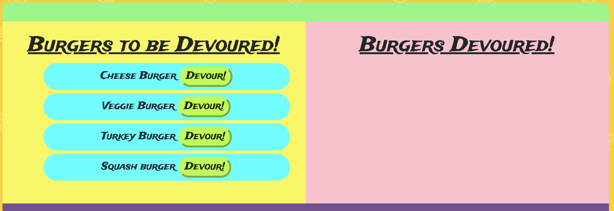
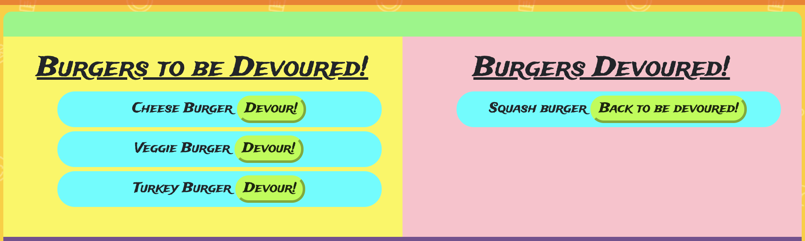

# Burger-App
A burger logging application implementing the use of a MVC design pattern using MySQL, Node, Express, Handlebars and an ORM.

https://whispering-sea-74102.herokuapp.com/

## User Story
As an avid burger consumer, I want to be able to log the burgers I want to consume and check them off of my list when I have tried them, so that I can easily keep track of my vast burger resume!

# Usage
Users of the Burger-App have the ability to add a new burger to the 'Burgers to be devoured' list, as well as move burgers from Burgers to be devoured' to 'Burgers Devoured' and vice versa.

#### Add a burger.

#### The current list of burgers to be devoured with the new burger added.

#### The current list of burgers with the Squash burger moved to  'Burgers Devoured'.

## Programming Languages Used
* HTML
* CSS
* Javascript
* jQuery

### Additional Styling Framework 
* Bootstrap | https://getbootstrap.com/
* Fontsawesome icons | https://fontawesome.com/icons?d=gallery&m=free