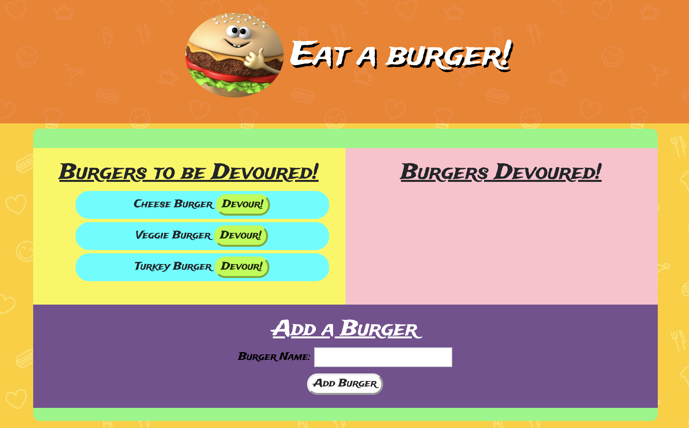
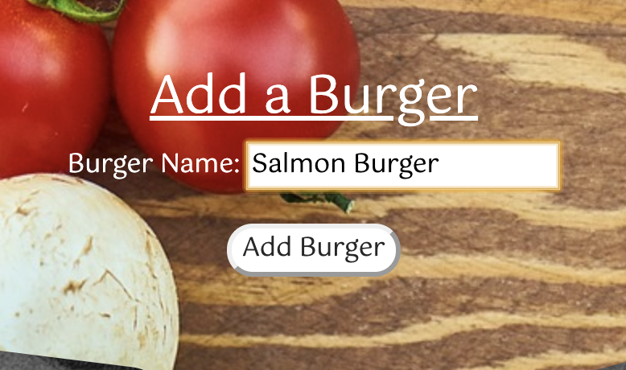
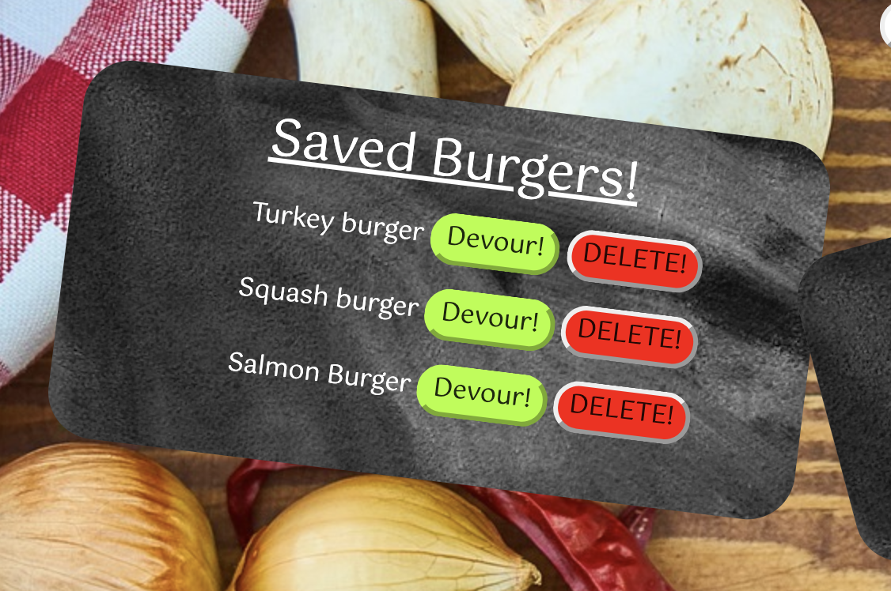
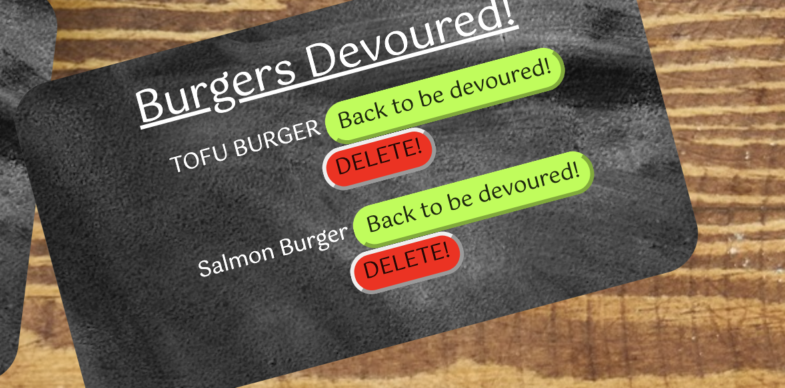

# Burger-App
A burger logging application implementing the use of a MVC design pattern, MySQL, Node, Express, Handlebars and an ORM.

https://whispering-sea-74102.herokuapp.com/

## User Story
As an avid burger consumer, I want the ability to log every burger I want to consume and check them off of my list as they are consumed, so that I can easily keep track of my vast burger resume!

# Usage
Users of the Burger-App have the ability to removed a burger from either list, add a new burger to the "Saved Burgers!" list, as well as move burgers from "Saved Burgers!" to "Burgers Devoured!" and vice versa.

#### Add a burger.

#### The current list of burgers with the salmon burger addition.

#### The current list of burgers with the salmon burger moved to  'Burgers Devoured'.

## Programming Languages Used
* HTML
* CSS
* Javascript
* jQuery

### Additional Styling Framework 
* Bootstrap | https://getbootstrap.com/
* Fontsawesome icons | https://fontawesome.com/icons?d=gallery&m=free